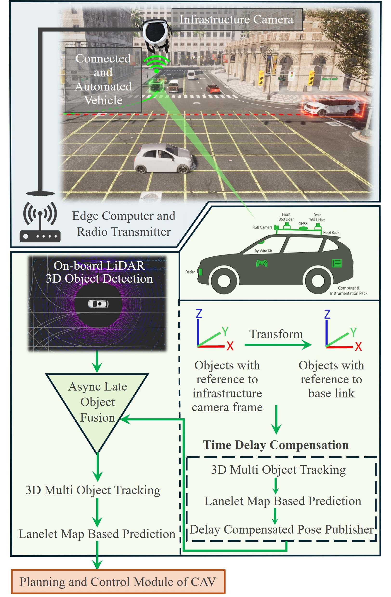
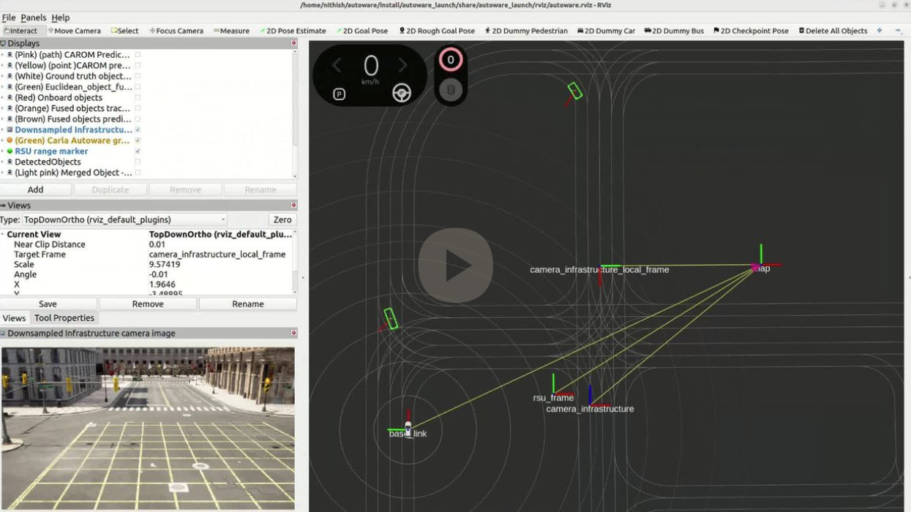
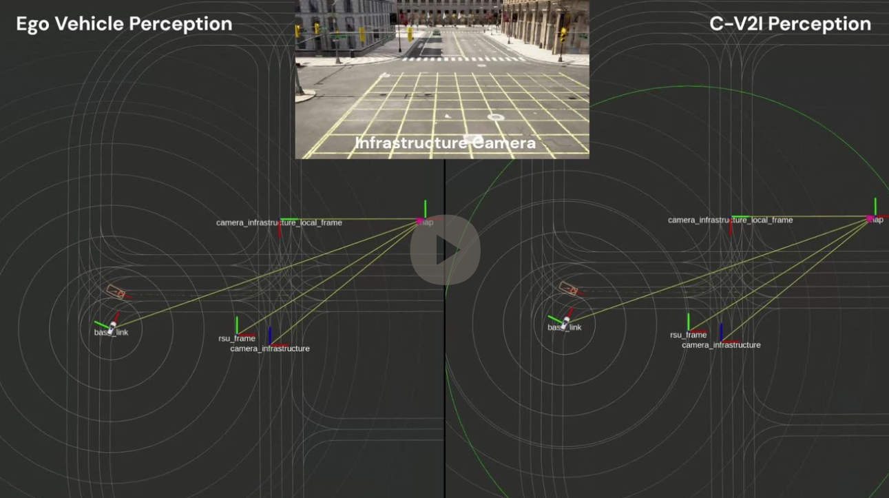

# Enhanced Cooperative Perception Through Asynchronous Vehicle to Infrastructure Framework with Delay Mitigation for Connected and Automated Vehicles

This repo provides necessary intructions and files to run the proposed C-V2I framework on your computer.

<h3 align="center">Proposed V2I Framework</h3>
<p align="center">

</p>

## Video Demonstration
<h3 align="center">Scenario 1 Groundtruth</h3>
<p align="center">
<a href="https://www.dropbox.com/scl/fi/ju9qcc3kok1mpw0n1azyh/Scenario-1-Ground-truth.mp4?rlkey=7k46ugxnwc8luhnyfcobg1if5&st=hxwpvtdz&dl=0"></a>
</p>

<h3 align="center">Perception Results without and with C-V2I framework</h3>
<p align="center">
<a href="https://www.dropbox.com/scl/fi/5sedgohe9e14qtlffmjcu/scenario1.mp4?rlkey=ezsymqz3wfciz2s0t77c6ucj4&st=xx7u2ssg&dl=0"></a>
</p>

## Usage
1. Autoware installation - [github repo](https://github.com/autowarefoundation/autoware/tree/release/2024.04)  
Note: Our framework is tested with Autoware version 2024.04

2. Download and install the custom created ROS2 packages for the proposed C-V2I framework
    ```
    # Change directory to your Autoware base folder
    cd autoware 

    # Clone the github repository
    git clone https://github.com/BELIV-ASU/Enhanced-Cooperative-Perception-Through-Asynchronous-V2I-Framework-with-Delay-Mitigation-for-CAVs.git V2I_repo

    # Import all the repos in CV2I.repos using vcs
    vcs import src < V2I_repo/CV2I.repos --recursive

    # Install dependencies
    rosdep install --from-paths src -y --ignore-src

    # Build the newly imported custom packages
    colcon build --packages-select infrastructure_objects_frame_transformation \
    infrastructure_objects_delay_compensation \
    euclidean_object_merger \
    sim_c_v2i_launch\
    autoware_launch\
    map_based_prediction
    ```

## Run the C-V2I Framework
- ROS2 bag files - [click here](https://www.dropbox.com/home/Nithish%20Saravanan/Nithish%20Thesis)  
+ CARLA Town10 lanelet and pointcloud map - [click here](https://www.dropbox.com/home/Nithish%20Saravanan/Nithish%20Thesis/Town10)  
Place in the map in the following folder:  
/home/**Your USERNAME**/autoware_map/Town10


1. Extract the ROS2 bag and run scenario 1 ROS2 bag file
    ```
    ros2 bag play your_ros2_bag_name.db3
    ```
2. Then launch the Autoware using the following command. Not all the modules in Autoware are required for this C-V2I framework. Only specific subsystems like
vehicle, system and map are launched and the rest of the subsystems are set to false in the autoware launch file to prevent them from being launched.
    ```
    cd autoware

    source install/setup.bash

    ros2 launch autoware_launch modified_autoware.launch.xml map_path:=your_map_path
    ```
3. Launch the C-V2I framework (**Remember to source autoware workspace**)
    ```
    cd autoware

    source install/setup.bash

    ros2 launch sim_c_v2i_launch sim_c_v2i.launch.xml
    ```

## Run Perception Framework alone without C-V2I
1. Extract the ROS2 bag and run scenario 1 ROS2 bag file
    ```
    ros2 bag play your_ros2_bag_name.db3
    ```
2. Launching the LiDAR Centerpoint algorithm
    ```
    ros2 launch lidar_centerpoint lidar_centerpoint.launch.xml
    input/pointcloud:=/sensing/lidar/concatenated/rate_downsampled/pointcloud
    output/objects:=/perception/object_recognition/detection/centerpoint/objects
    ```

3. Launch Multi-Object Tracking
    ```
    ros2 launch multi_object_tracker multi_object_tracker.launch.xml
    input:=/perception/object_recognition/detection/centerpoint/objects
    output:=/perception/object_recognition/tracking/centerpoint/objects
    ```

4. Launch Map based prediction
    ```
    ros2 launch map_based_prediction map_based_prediction.launch.xml
    input_topic:=/perception/object_recognition/tracking/centerpoint/objects
    output_topic:=/perception/object_recognition/prediction/onboard_objects
    ```
## Scneario Generation
Please checkout the scenario generation process at [this](https://github.com/BELIV-ASU/Scenario-Generation-Nithish-Thesis.git) repo.   

You can use this repo to recreate the scnerios which I already provided and can also use it as a template to create your own scnerios.

## Note
The setup is tested with
- Autoware version 2024.04 on Ubuntu 22.04 (ROS Humble)